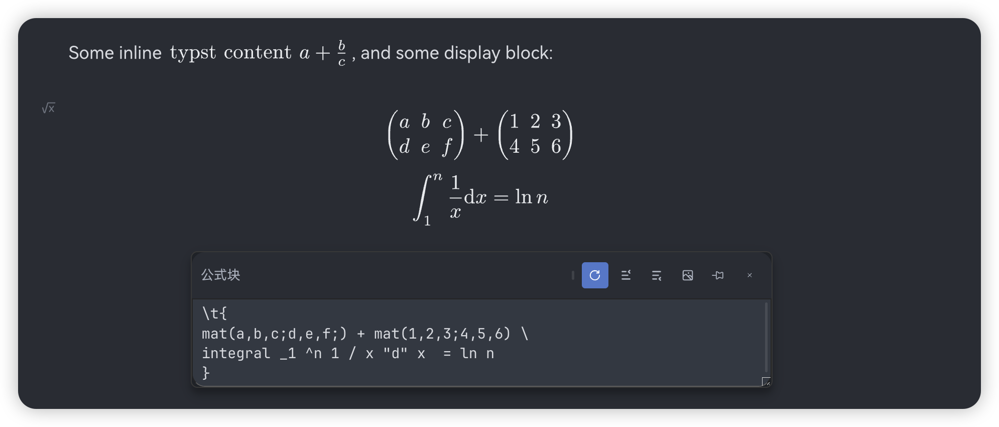
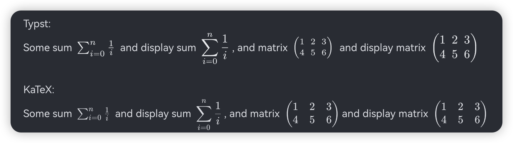

# SiYuan Typst Plugin

[中文版](./README_zh_CN.md)

Add Experimental Typst Support for SiYuan Note.

**This is highly experimental and unstable at current state, relying on  SiYuan Note's DOM tree structure which is not guaranteed to be stable. Before SiYuan's Custom Inline Element feature is implemented, no better solution is possible. USE AT YOUR OWN RISK.**

Just write using normal Math Block, but wrap it with `\t{typst content}`, for example:

```
Some inline $\t{"typst content" a + b / c}$, and some display block:

$$ \t{
mat(a,b,c;d,e,f;) + mat(1,2,3;4,5,6) \
integral _1 ^n 1 / x "d" x  = ln n
} $$
```

You'll get:



## Current Limitations

- Export/Preview and many corner cases are not supported yet.

## Caveats

Typst use Inline Style for inline math, sometimes it may look to small for complex expressions.

You can use `display()` function to wrap your typst content to display block.

Example:

```
Some sum $\t{sum _(i=0) ^n 1  / i}$ and display sum $\t{display(sum _(i=0) ^n 1  / i)}$, and matrix $\t{display(mat(1,2,3;4,5,6))}$
```

Versus KaTeX:

```
Some sum $\sum _{i=0} ^n \frac{1}{i}$ and display sum $\displaystyle \sum _{i=0}^n \frac{1}{i}$, and matrix $\begin{pmatrix} 1 & 2 & 3 \\ 4 & 5 & 6 \end{pmatrix}$and display matrix $\displaystyle \begin{pmatrix} 1 & 2 & 3 \\ 4 & 5 & 6 \end{pmatrix}$
```


