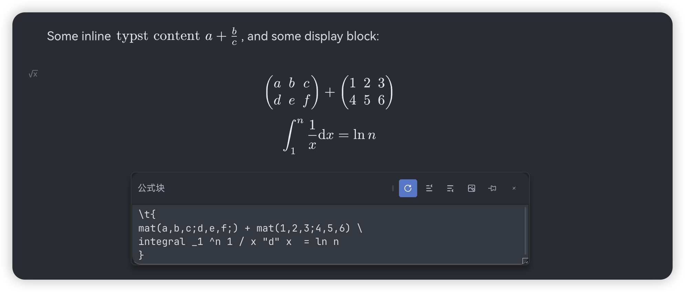
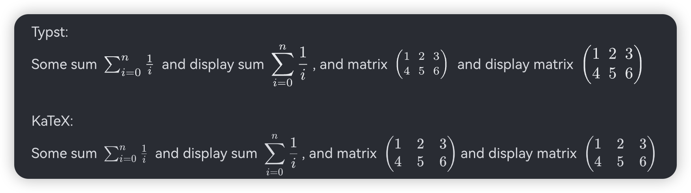

# SiYuan Typst Plugin

[English](./README.md)


为思源笔记添加 Typst 支持，支持在笔记中使用 Typst 语法。

**该项目高度实验性，依赖于思源笔记的 DOM 结构而非稳定 API，可能存在兼容性问题。在思源笔记官方的 Custom Inline Element 功能实现前，可能并没有更好的实现方案。请自行斟酌使用风险。**

使用正常的数学公式块，将 Typst 内容包裹在 `\t{typst content}` 中，例如：

```
Some inline $\t{"typst content" a + b / c}$, and some display block:

$$ \t{
mat(a,b,c;d,e,f;) + mat(1,2,3;4,5,6) \
} $$
```

例子：



## Current Limitations

- 导出/预览等各种渲染显示场景未适配。

## Caveats

Typst 为行内公式使用 Inline Style，复杂的公式会显得太小。

你可以使用 `display()` 来渲染复杂公式。

例如：

```
Some sum $\t{sum _(i=0) ^n 1  / i}$ and display sum $\t{display(sum _(i=0) ^n 1  / i)}$, and matrix $\t{display(mat(1,2,3;4,5,6))}$
```

Versus KaTeX:

```
Some sum $\sum _{i=0} ^n \frac{1}{i}$ and display sum $\displaystyle \sum _{i=0}^n \frac{1}{i}$, and matrix $\begin{pmatrix} 1 & 2 & 3 \\ 4 & 5 & 6 \end{pmatrix}$and display matrix $\displaystyle \begin{pmatrix} 1 & 2 & 3 \\ 4 & 5 & 6 \end{pmatrix}$
```


